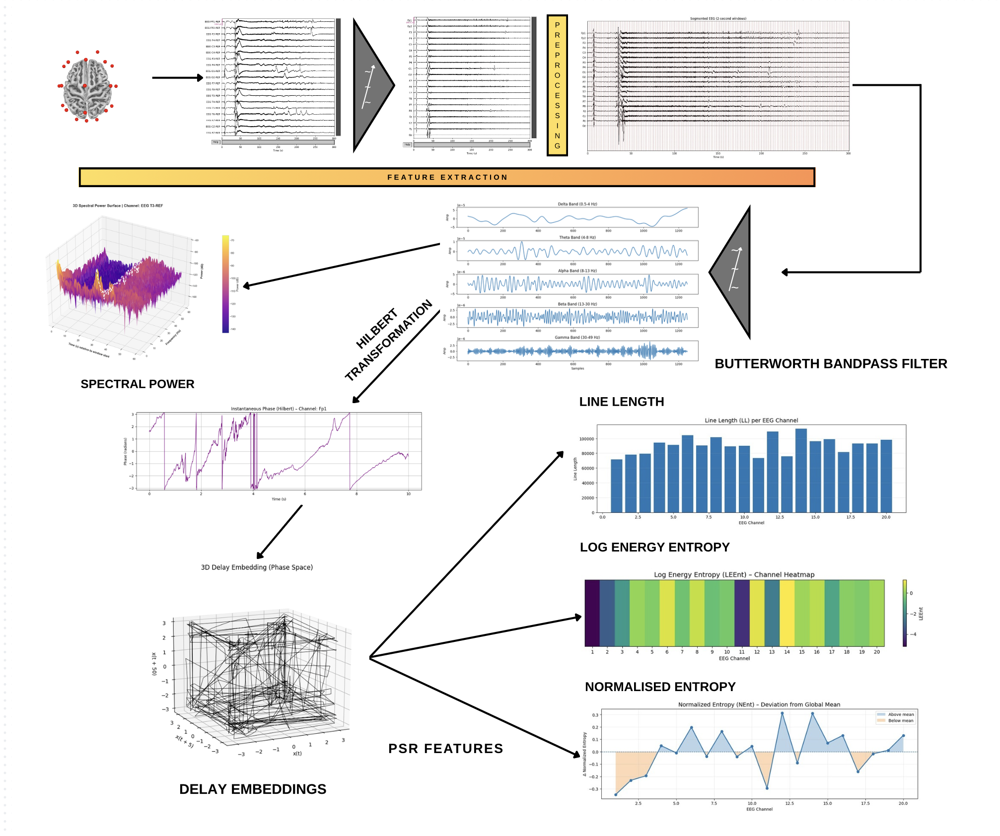

# T2P-EEG: Time-to-Phase Conversion of Oscillatory EEG Signals for Seizure Detection and Prediction

## ABSTRACT
The detection and prediction of seizures based on Electroencephalography (EEG) remain intrinsically difficult owing to the pronounced nonstationarity and nonlinear dynamics that govern neural activity. This work pioneers a novel paradigm by reformulating EEG recordings into phase-based reconstruction (PSR) which are inherently invariant to amplitude modulation and furnish a direct characterization of temporal synchronization and coordination among distributed neural assemblies. Extensive validation on the TUH EEG Seizure Corpus demonstrates that the proposed framework decisively surpasses prevailing state-of-the-art approaches, attaining a receiver operating characteristic area under the curve (ROC–AUC) of 0.9816 for seizure detection and 0.9855 for seizure prediction under a 10-minute forecasting horizon.

---

## Dataset

This project uses the publicly available Temple University Seizure Corpus (TUS), a subset of the Temple University EEG Corpus (TUEG). 

---

## Methodology

### 1. Data Preprocessing

* Filtering, Resampling and Normalization 
* Extracting Seizure annotation
* Sliding Window Segmentation
* Label generation for seizure detection and prediction
* Dataset construction

### 2. Feature Extraction

* Decomposing of signal into differnt frequency bands : delta (0.5–4Hz), theta (4–8 Hz), alpha (8–13 Hz), beta (13–30 Hz), and gamma (30–49 Hz).
* Transformation of EEG from time to phase using Hilbert transform for each band
* Constructing the Phase Space Representaion (PSR) using delay embedding
* Extracting features such as Spectral Power from Hilbert transformed signal, and Line length, Log Energy Entropy, Normalized Entropy from PSR.

### 3. Results

XGBoost achieved an ROC-AUC of 0.9816 for seizure detection and 0.9855 for seizure prediction for a 10 minute prediction window.

## File Description

* Processing.ipynb : code for pre-processing and dataset creation. Also includes visualizations of raw EEG signal, hilbert transformed signal, decomposed frequency bands of EEG, Spectral power plot.
* Seizure_detection.ipynb : XGBoost models with different hyperparameters trained to detect seizures
* Seizure_prediction.ipynb : XGBoost with different hyperparameters trained to predict seizures
